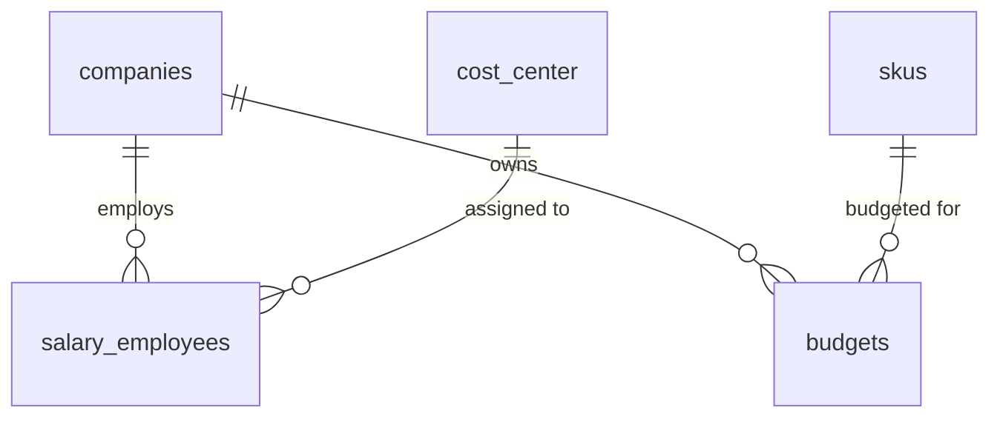

### ۱. تغییراتی مورد نیاز در دیتابیس

#### ۱.۱. یکدست‌سازی Engine و Charset/Collation
* تبدیل تمامی جداول دارای `MyISAM` (مانند جداول Pivot دسترسی‌ها) به `InnoDB` جهت پشتیبانی از Foreign Key و هماهنگی قفل‌گذاری.
* تبدیل تمامی جداول دارای `latin1` (مانند `salary_employees`، `depreciation`، `cash_flow`) به `utf8mb4` با Collation یکدست `utf8mb4_unicode_ci` جهت جلوگیری از Collation Mismatch در مقایسه رشته‌های فارسی.

**مثال:**
```sql
ALTER TABLE `salary_employees` 
  ENGINE = InnoDB,
  CONVERT TO CHARACTER SET utf8mb4 COLLATE utf8mb4_unicode_ci;
```

---

#### ۱.۲. تعریف صریح Foreign Key Constraints
* تمامی ارتباطات ضمنی (`*_id`) باید به صورت رسمی با `ADD CONSTRAINT FOREIGN KEY` تعریف شوند تا Join Pathها در استخراج Schema Graph توسط Agent مشخص باشند.

**مثال:**
```sql
ALTER TABLE `salary_employees`
  ADD CONSTRAINT `fk_salary_cost_center` FOREIGN KEY (`cost_center_id`) REFERENCES `cost_center` (`id`),
  ADD CONSTRAINT `fk_salary_company` FOREIGN KEY (`company_id`) REFERENCES `companies` (`id`);

ALTER TABLE `budgets`
  ADD CONSTRAINT `fk_budgets_sku` FOREIGN KEY (`sku_id`) REFERENCES `skus` (`id`);
```

---

#### ۱.۳. افزودن SQL Comments به جداول و ستون‌ها
* ثبت توضیح و مقادیر مجاز فیلدها، به‌ویژه کدهای اختصاری مانند `zv_line_id`، `cogs_type`، `payeh_sanavat` و `driver` در متادیتای ستون‌ها.

**مثال:**
```sql
ALTER TABLE `salary_employees`
  MODIFY COLUMN `cost_type` varchar(20) DEFAULT 'opex' COMMENT 'Allowed values: opex, cogs, non-cogs',
  MODIFY COLUMN `payeh_sanavat` bit(1) DEFAULT b'0' COMMENT 'Base seniority pay flag: 1 = eligible, 0 = not eligible';

ALTER TABLE `depreciation`
  MODIFY COLUMN `zv_line_id` int(11) NULL COMMENT 'Zero Volume line reference ID';
```

---

#### ۱.۴. ایجاد Unpivoted Views برای جداول افقی (`m1` تا `m12`)
* تبدیل جداول Wide ماهانه (`budgets`, `depreciation`, `salary_increases`, `balance_sheet_data`) به Viewهای خطی و نرمال (`year`, `month`, `value`) جهت تسهیل فیلترهای زمانی، توابع `AVG()` و `GROUP BY` برای Model.

**مثال:**
```sql
CREATE OR REPLACE VIEW `v_monthly_budgets` AS
SELECT company_id, sku_id, year, 1 AS month_num, m1 AS amount FROM budgets
UNION ALL
SELECT company_id, sku_id, year, 2, m2 FROM budgets
-- تا ماه 12
UNION ALL
SELECT company_id, sku_id, year, 12, m12 FROM budgets;
```

---

#### ۱.۵. ایندکس‌گذاری روی فیلدهای ابعادی و متنی (Entity Lookup Indexes)
* تعریف Index روی ستون‌های نام، عنوان و کد در جداول مرجع برای سرعت عملیات Entity Resolution در Agent.

**مثال:**
```sql
CREATE INDEX `idx_salary_emp_family_name` ON `salary_employees` (`family`, `name`);
CREATE INDEX `idx_cost_center_title` ON `cost_center` (`title`);
CREATE INDEX `idx_budgets_company_year` ON `budgets` (`company_id`, `year`);
```

---

#### ۱.۶. ساخت Dedicated Read-Only User با Resource Limit
* ساخت یوزر با دسترسی صرفاً خواندنی، بدون دسترسی به جداول حساس امنیتی (`oauth_*`, `admin_*`) به همراه محدودیت زمان اجرا (`MAX_EXECUTION_TIME`).

**مثال:**
```sql
CREATE USER 'ai_agent_ro'@'%' IDENTIFIED BY 'StrongPass_123';
GRANT SELECT ON finrise_db.* TO 'ai_agent_ro'@'%';
REVOKE SELECT ON finrise_db.oauth_access_tokens FROM 'ai_agent_ro'@'%';
REVOKE SELECT ON finrise_db.admin_permissions FROM 'ai_agent_ro'@'%';
```

---

### ۲. داکیومنت‌های مورد نیاز

#### ۲.۱. فایل Data Dictionary & Metadata
* یک فایل ساخت‌یافته (JSON یا YAML) که شامل توضیحات بیزینسی، مترادف‌ها (Synonyms) و مقادیر مجاز برای هر جدول است.

**مثال (`metadata_budgets.yaml`):**
```yaml
table_name: budgets
view_name: v_monthly_budgets
domain: Sales Planning
description: "حاوی پیش‌بینی و بودجه فروش مقداری و ریالی کالاها به تفکیک سال و ماه"
synonyms:
  - "بودجه فروش"
  - "تارگت کالاها"
  - "هدف‌گذاری ماهانه"
primary_keys: ["sku_id", "year"]
allowed_values:
  driver: ["manual", "formula", "channel_share"]
join_hints:
  - "JOIN skus ON budgets.sku_id = skus.id"
  - "JOIN companies ON skus.company_id = companies.id"
```

---

#### ۲.۲. دیتاست ارزیابی و نمونه‌ها (Golden Queries Dataset / Few-Shot)
* یک فایل JSON حاوی حداقل ۳۰ تا ۵۰ جفت `(User Query -> Target SQL)` استاندارد و تاییدشده بیزینسی برای In-Context Learning و بنچ‌مارک ارزیابی دقت مدل.

**مثال (`golden_queries.json`):**
```json
[
  {
    "id": "GOLDEN_001",
    "question": "جمع کل بودجه سه ماهه اول سال 1403 برای هر کالا چقدر است؟",
    "domain": "budgets",
    "target_sql": "SELECT sku_id, SUM(amount) AS q1_budget FROM v_monthly_budgets WHERE year = 1403 AND month_num BETWEEN 1 AND 3 GROUP BY sku_id;",
    "tables_involved": ["v_monthly_budgets"]
  },
  {
    "id": "GOLDEN_002",
    "question": "لیست پرسنل با نوع هزینه opex در مرکز هزینه انبار",
    "domain": "payroll",
    "target_sql": "SELECT se.code, se.name, se.family FROM salary_employees se JOIN cost_center cc ON se.cost_center_id = cc.id WHERE cc.title = 'انبار' AND se.cost_type = 'opex';",
    "tables_involved": ["salary_employees", "cost_center"]
  }
]
```

---

#### ۲.۳. داکیومنت منطق‌های محاسباتی بیزینس (Business Logic & Metric Calculation Guide)
* مستندسازی فرمول‌ها و قواعد مالی خاص سیستم که در DDL دیده نمی‌شوند، تا به صورت Rule به پرامپت مدل تزریق شوند.

**مثال:**
* **نحوه فیلتر پرسنل فعال:** شرط `WHERE is_system = 0 AND joining_date <= UNIX_TIMESTAMP()` الزامی است.
* **تفکیک هزینه سربار از اداری:** فیلد `cost_type` با مقدار `cogs` نشان‌دهنده بهای تمام‌شده تولید و مقدار `opex` مربوط به هزینه‌های عمومی/اداری است.
* **کدهای Zero Volume:** فیلدهای `zv_line_id` نشان‌دهنده خطوط تولید فاقد حجم در محاسبات استهلاک هستند و نباید در جمع ظرفیت‌ها لحاظ شوند.

---

#### ۲.۴. دیاگرام ارتباطات دیتابیس (ERD / Relationship Graph Export)
* یک خروجی تمیز از گراف دیتابیس در قالب Mermaid، PlantUML یا خروجی Schema Spy جهت استخراج مستقیم همسایگی جداول در الگوریتم‌های Schema Linking.

**مثال (Mermaid Format):**

